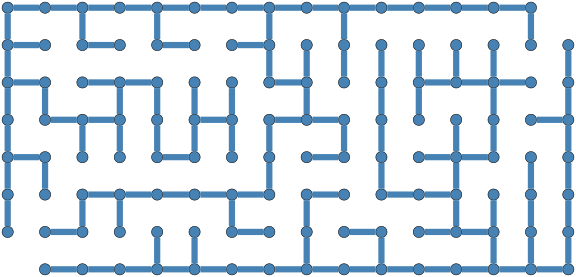

# Raku Graph::RandomMaze

Raku package for random maze making using graphs.

The package provides the function `random-maze` the implementation of which is explained in [AA1]. 

**Remark:** Since the package "Graph", [AAp1], is used for the implementation the package name is
"Graph::RandomMaze".

## Usage

### Rectangular maze

```raku
use Graph::RandomMaze;

my %rect = random-maze(rows => 8, columns => 16, grid-layout => 'rectangular', properties => Whatever);
```

```raku, eval=FALSE
my %opts = engine => 'neato', :8size, vertex-shape => 'point', edge-thickness => 12;
%rect<walls>.dot(|%opts):svg;
```



### Hexagonal maze

```raku
my %hex = random-maze(rows => 8, columns => 16, type => 'hexagonal', properties => Whatever);
```

**Remark:** The option names "type" and "shape" are synonyms of the option "grid-layout".

```raku, eval=FALSE
%opts<edge-thickness> = 32;
%hex<walls>.dot(|%opts):svg;
```


The returned hash contains:
- Carved wall graph (`walls`), 
- Spanning tree used for carving (`paths`), 
- Shortest-path solution (`solution`), 
- Bookkeeping keys (`shape`, `dimensions`, `start`, `end`)

----

## CLI

The package provides the Command Line Interface (CLI) script `random-maze` for making random mazes 
and exporting them in different formats. Here is the usage message:

```shell
random-maze --help
```

----


## References

[AA1] Anton Antonov,
["Day 24 – Maze Making Using Graphs"](https://raku-advent.blog/2025/12/24/day-24-maze-making-using-graphs/),
(2025),
[Raku Advent Calendar at WordPress](https://raku-advent.blog/).

[AAp1] Anton Antonov,
[Graph, Raku package](https://github.com/antononcube/Raku-Graph),
(2024-2025),
[GitHub/antononcube](https://github.com/antononcube).

[AAf1] Anton Antonov,
[RandomLabyrinth](),
(2026),
[Wolfram Function Repository](https://resources.wolframcloud.com/FunctionRepositor).